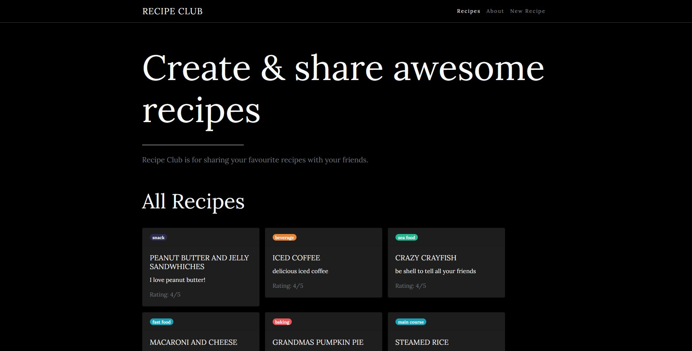
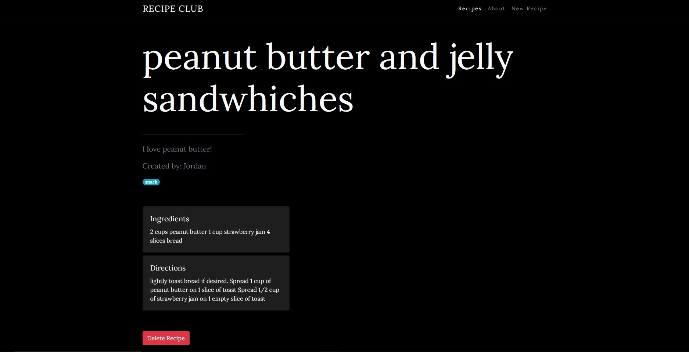
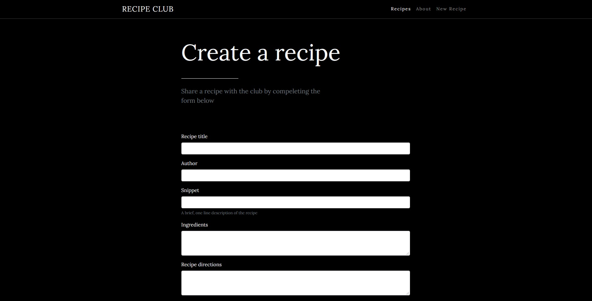

<h1 align="center">
  Recipe App 👨🏼‍🍳
</h1>

## Introduction 

This is a basic CRUD app that I built as a way to learn [Node.js](https://node.js.org/) and [Express](https://expressjs.com/). This is a recipe app where users can create and share recipes and rate them.  

### Features

* Users can create & rate recipes. 
* SSR - server-side rendering
* Responsive Design

### Technologies

* [Express](https://expressjs.com/) v4.17.1
* [Node.js](https://nodejs.org/en/) vv14.4.0
* [EJS](https://ejs.co/) Embedded JavaScript Templating
* [Bootstrap](https://getbootstrap.com/) v4.5.0
* [Nodemon Dev Server](https://nodemon.io/)
* [MongoDB Atlas](https://www.mongodb.com/cloud/atlas)
* [Helmet](https://www.npmjs.com/package/helmet) v3.23.3 Middleware
* [Mongoose](https://www.npmjs.com/package/mongoose) v5.9.25 ODM
* [Morgan](https://www.npmjs.com/package/morgan) Logger

## Installation 

This app requires [Node.js](https://node.js.org/) v14.4.0 to run

### Install the dependecies

```sh
$ npm install
```
You will also need to configure the environment variables for this project. 

Create a `.env` file and include your specific DB Uri details

```
DB_URI = 'your DB uri will go here'
```

### Start the dev server

```sh
$ cd recipe-app
$ nodemon
```

| Screen Shots |  |
| ----------- | ----------- |
|  |  |
|  | 


## Todo
* Add user auth 
* Add update recipe route
* Refactor DB validation 